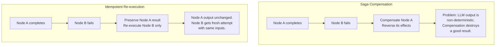
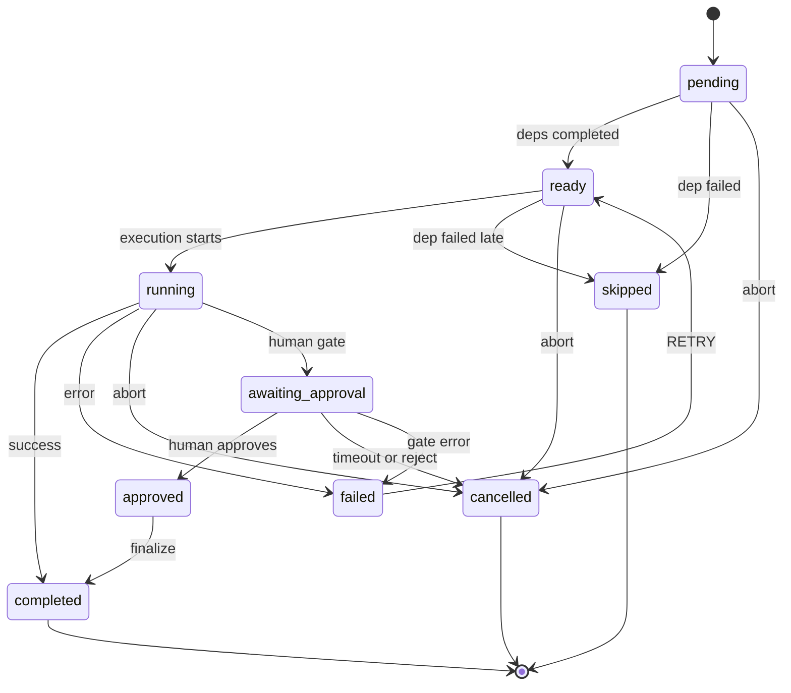
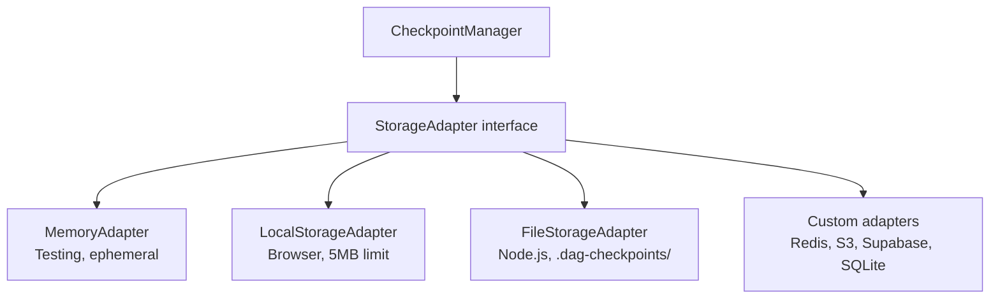
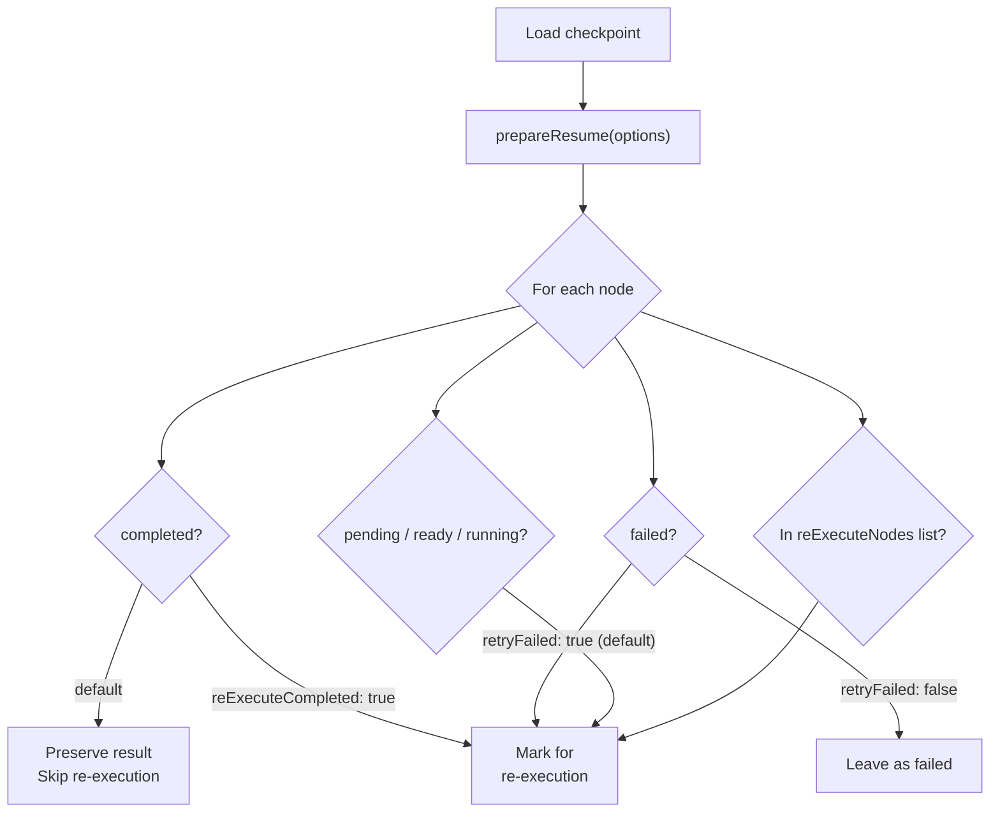
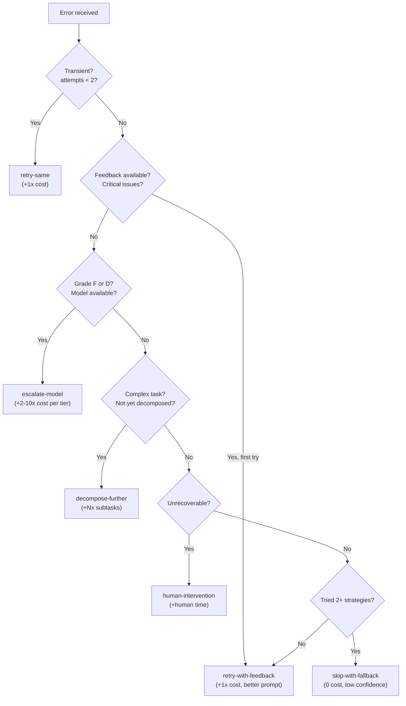

# WinDAGs Resilience

The execution infrastructure that makes WinDAGs recoverable. Three pillars: validated state management (preventing illegal transitions), checkpoint persistence (enabling resume from any wave boundary), and intelligent recovery (selecting the right strategy for each error class).

The core insight: LLM agent outputs are non-deterministic and expensive. Idempotent re-execution of failed nodes while preserving completed results is cheaper and more reliable than saga-based compensation.

## When to Use

**Use for**:
- Designing state machines for DAG node lifecycles
- Implementing checkpoint persistence with pluggable storage
- Building resume protocols that preserve completed work
- Selecting recovery strategies based on error classification
- Adding auto-save intervals to long-running executions
- Implementing phase boundary checkpoints for multi-phase DAGs
- Deciding between idempotent re-execution and saga compensation

**NOT for**:
- Failure classification and DAG mutation at runtime (use `windags-mutator`)
- Pre-execution risk scanning and failure timing analysis (use `windags-premortem`)
- Quality evaluation of node outputs (use `windags-evaluator`)
- DAG topology design and execution engine selection (use `windags-architect`)
- Learning updates and skill quality tracking (use `windags-curator`)

---

## Core Insight: Idempotent Re-execution vs. Saga Compensation



Why idempotent re-execution wins for LLM orchestration:

1. **Non-determinism**: Re-running Node A produces different text. Compensation means losing a good result you cannot reproduce.
2. **Cost**: Compensation requires undoing work that cost tokens, then redoing it. Re-execution of just the failed node skips all that.
3. **Bounded side effects**: In WinDAGs, node outputs are the primary artifact. There are no external database mutations to reverse.
4. **Checkpoints make it free**: Completed results are already persisted. Resume is "skip completed, retry failed."

**When saga compensation IS appropriate**: The mutator's 7 mutation types (add_node, remove_node, replace_node, etc.) DO use saga compensation because they modify the **DAG structure itself**, not individual node outputs. Topology changes are a different abstraction level — removing a node and its edges is a reversible structural operation. Individual node re-execution is not.

---

## State Machine Design

Every node in a WinDAGs execution passes through a validated state machine. The transition matrix is enforced at runtime — illegal transitions throw immediately rather than corrupting state silently.

### Transition Matrix

| From State | Allowed Transitions | Rationale |
|---|---|---|
| `pending` | `ready`, `skipped`, `cancelled` | Dependencies not yet met |
| `ready` | `running`, `skipped`, `cancelled` | All dependencies completed |
| `running` | `completed`, `failed`, `cancelled`, `awaiting_approval` | Active execution |
| `awaiting_approval` | `approved`, `cancelled`, `failed` | Human gate active |
| `approved` | `completed` | Post-approval finalization |
| `completed` | *(terminal)* | Immutable — preserved on resume |
| `failed` | `ready` | Retry path — re-enters ready check |
| `skipped` | *(terminal)* | Dependency failed upstream |
| `cancelled` | *(terminal)* | User or system abort |



### Design Decisions

- **`failed → ready` (not `failed → running`)**: Forces the node through the ready-check again, verifying dependencies are still valid before retry. A dependency may have been cancelled while this node was failing.
- **`completed` is terminal**: No re-execution through state transitions. To re-execute a completed node, use the checkpoint resume protocol with `reExecuteCompleted: true`. This is a deliberate choice — accidental re-execution of expensive completed nodes is the most common resilience bug.
- **`skipped` propagates deterministically**: If any dependency fails or is skipped, downstream nodes skip. No partial execution of a dependency chain.
- **Fail-fast on illegal transitions**: Throw `InvalidStateTransitionError`, don't silently ignore. Silent corruption of the state machine is worse than a crash.

**BC-RESIL-001**: All state transitions MUST pass through transition validation. Direct state assignment bypassing the matrix is prohibited. Every transition emits an event to listeners (for logging, quality tracking, cost accounting).

---

## Checkpoint Architecture

A checkpoint captures the minimum state needed to resume execution from any wave boundary.

### What to Persist

```
Checkpoint {
  id:         dagId-executionId-timestamp
  dag:        node IDs, dependencies, configs (minimal structure)
  execution:  node states, final outputs, errors, current wave, token usage
  version:    schema version for forward compatibility
  metadata:   phase info, project context
}
```

**What NOT to persist**: Full conversation histories, intermediate LLM turns, model weights, raw prompts. Only structural state and final outputs. Checkpoints should be <1MB, not 50MB.

### Storage Adapter Pattern



The interface is simple: `get`, `set`, `delete`, `has`, `keys`, `clear`, `getStats`. Any backend that implements these 7 methods works as a checkpoint store. Auto-detection picks the right adapter for the environment.

### When to Checkpoint

| Trigger | Required? | Rationale |
|---------|-----------|-----------|
| Wave completion | **Mandatory** | Natural synchronization point. All nodes in wave are terminal. |
| Phase boundary | **Mandatory** | Multi-phase DAGs need coarse-grained recovery points. |
| Before human gates | Recommended | Humans are slow. Crash during wait = lost progress. |
| Before expensive nodes | Recommended | Opus-tier nodes cost tokens. Checkpoint before, not after. |
| Auto-save interval | Optional | Configurable timer for long-running waves. |

### Cleanup

`maxCheckpointsPerDAG` (default: 10). Oldest-first deletion. Prevents storage bloat in production systems that run thousands of DAGs.

**BC-RESIL-002**: Checkpoints MUST be saved at every wave boundary and every phase boundary. The minimum checkpoint frequency is once per wave completion. Within a wave, checkpointing is optional.

---

## Resume Protocol

Resume is where idempotent re-execution becomes concrete. The protocol determines which nodes to re-execute and which to preserve.



The resume output: `nodesToExecute` (set), `completedResults` (preserved map), `startFromWave` (calculated from node states), `previousTokenUsage` (accumulated).

### Wave Recalculation

The executor recalculates which wave to start from based on which nodes need execution. If waves 0-2 are fully completed and wave 3 has failures, execution resumes at wave 3. Waves 0-2 are never re-entered.

**BC-RESIL-003**: When resuming, completed node results MUST be injected into the execution state before any node begins. Downstream nodes that depend on completed nodes must receive the preserved outputs, not null. Failure to inject results produces cascading `MISSING_DEPENDENCY` errors.

---

## Recovery Strategy Selection

When a node fails, the RecoveryManager classifies the error and selects a recovery strategy. Strategies escalate by cost — cheap retries first, expensive interventions last.

### Error Classification

| Error Code | Category | Behavior |
|---|---|---|
| `TIMEOUT`, `RATE_LIMITED` | transient | Likely succeeds on retry |
| `MODEL_ERROR`, `TOOL_ERROR` | model-limitation | Needs different or better model |
| `INVALID_OUTPUT`, `SCHEMA_MISMATCH` | complexity | Task too complex for one node |
| `PERMISSION_DENIED`, `SCOPE_VIOLATION`, `ISOLATION_BREACH`, `CYCLE_DETECTED` | unrecoverable | Human intervention required |

### Strategy Selection



### The Six Strategies

| Strategy | When | What Changes | Cost |
|---|---|---|---|
| `retry-same` | Transient errors, first attempt | Nothing — same request | +1x original |
| `retry-with-feedback` | Quality issues identified | Prompt augmented with feedback | +1x original |
| `escalate-model` | Model limitation detected | Model tier: haiku → sonnet → opus | +2-10x per tier |
| `decompose-further` | Task too complex for one node | DAG structure (delegated externally) | +Nx subtasks |
| `human-intervention` | Unrecoverable error | Execution pauses for human | +human time |
| `skip-with-fallback` | All strategies exhausted | Uses default/placeholder output | 0 (but unreliable) |

**How this differs from the mutator's escalation ladder**: Recovery operates on a **single node** — retry it, improve its prompt, upgrade its model. The mutator operates on the **DAG topology** — add nodes, remove edges, restructure waves. Recovery is the first responder; the mutator is called when recovery fails and the DAG itself needs surgery.

**BC-RESIL-004**: Recovery strategies MUST be attempted in escalating cost order. `retry-same` before `retry-with-feedback` before `escalate-model`. Do not jump to an expensive strategy when a cheap one has not been tried. Each attempt is logged with strategy name, cost, and outcome.

---

## Wave-Based Execution

Nodes are organized into topological waves. Within a wave, nodes execute in parallel (bounded by `maxParallelism`). Between waves, the system checkpoints and synchronizes.

**Why waves, not greedy scheduling?**

Greedy scheduling executes any node whose dependencies are met, immediately. Maximum parallelism, but:
1. No natural checkpoint boundaries — where do you save state mid-execution?
2. Unpredictable failure blast radius — a failure mid-stream affects an unknown number of in-flight nodes
3. Cannot resolve vague nodes — deferred planning needs completed wave results before the next wave's nodes are finalized

Wave scheduling accepts slightly lower parallelism for predictable recovery points. Each wave boundary is a synchronization barrier where checkpoints, vague-node resolution, and progress reporting happen.

**Backpressure**: If a wave has 12 nodes and `maxParallelism=4`, the executor runs 3 sequential batches of 4. This prevents overwhelming LLM API rate limits and keeps cost predictable per batch.

**BC-RESIL-005**: Wave transitions are synchronization barriers. All nodes in wave N must reach a terminal state (completed, failed, skipped, or cancelled) before any node in wave N+1 begins. No early starts.

---

## Phase Boundaries

Multi-phase DAGs (RESEARCH → PLAN → BUILD → RELEASE) add a coarser checkpoint layer above waves.

The phase orchestrator:
1. Executes each phase as a separate DAG with its own waves
2. Saves a checkpoint at every phase boundary
3. Passes accumulated outputs from completed phases to the next phase's DAG generator
4. Each phase can dynamically generate its DAG based on prior results

A failed BUILD phase resumes from the BUILD boundary. RESEARCH and PLAN outputs are preserved in the checkpoint — no re-execution.

**Relationship to wave checkpoints**: Phase boundaries are coarser-grained. A phase contains multiple waves. Wave checkpoints enable intra-phase recovery. Phase checkpoints enable inter-phase recovery.

---

## Anti-Patterns

### The Eager Compensator

| | |
|---|---|
| **Novice** | Implements saga compensation for individual node failures, rolling back completed nodes to "redo" them with corrected upstream context |
| **Expert** | Preserves completed results, re-executes only the failed node. Uses resume with `retryFailed: true, reExecuteCompleted: false`. |
| **Timeline** | Novice wastes 60-80% of tokens re-executing successful nodes and gets different (possibly worse) results. Expert preserves good work and spends tokens only on the failure. |

### The Greedy Scheduler

| | |
|---|---|
| **Novice** | Launches every ready node immediately, maximizing parallelism, no wave boundaries |
| **Expert** | Uses wave-based execution with checkpoint boundaries, accepting slightly lower parallelism for predictable recovery |
| **Timeline** | Novice's execution crashes mid-DAG with 15 in-flight nodes and no checkpoint. Restarts from scratch. Expert resumes from wave 3 of 7, preserving 40% of completed work. |

### The Monolithic Checkpoint

| | |
|---|---|
| **Novice** | Serializes the entire execution state — conversation histories, intermediate LLM turns, full prompts, raw tool outputs — into every checkpoint |
| **Expert** | Checkpoints only structural state: node statuses, final outputs, wave position, token counts. Loads reference data on demand during resume. |
| **Timeline** | Novice's checkpoints are 50MB+ each. Storage fills up after 20 DAGs. Expert's checkpoints are <1MB. Can store thousands. |

### The Optimistic Skipper

| | |
|---|---|
| **Novice** | Node A completed, so its output must be fine — pass it downstream without validation |
| **Expert** | Validates every completed node's output against the downstream node's input contract at the wave boundary before marking dependents as ready |
| **Timeline** | Novice gets cascading byzantine failures where subtly wrong outputs propagate through 4 waves before anyone notices. Expert catches the mismatch at wave 1 and triggers recovery on Node A. |

---

## Behavioral Contracts

| Contract | Requirement | Enforcement |
|---|---|---|
| **BC-RESIL-001** | All state transitions validated against transition matrix | `isValidTransition()` check; `InvalidStateTransitionError` on violation |
| **BC-RESIL-002** | Checkpoint at every wave boundary and phase boundary | Mandatory save after wave completion and at phase boundary events |
| **BC-RESIL-003** | Resumed executions inject preserved completed results before starting | Resume protocol populates completed results; executor restores before wave loop |
| **BC-RESIL-004** | Recovery strategies attempted in escalating cost order | Strategy selector checks attempt count and previously used strategies |
| **BC-RESIL-005** | Wave transitions are synchronization barriers | Wave-complete check ensures all nodes terminal before advancing |

---

## Reference Files

Consult for deep dives — NOT loaded by default.

| File | Consult When |
|------|-------------|
| `references/state-machine-implementation.md` | Implementing the state manager: transition validation, event emission, wave management, snapshot/restore, cascading skip propagation |
| `references/checkpoint-storage-adapters.md` | Building storage adapters, auto-save implementation, checkpoint cleanup, version migration, serialization patterns |
| `references/recovery-strategy-details.md` | Full recovery loop, error classification logic, feedback augmentation, model escalation paths, decomposition delegation, cost tracking |
| `references/phase-orchestration-resilience.md` | Multi-phase checkpoint/resume, phase boundary events, accumulated output preservation, abort handling, phase-level timeouts |
