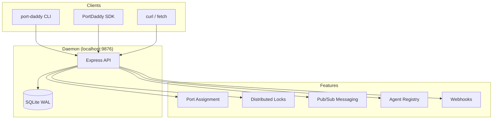

# Port Daddy CLI

Authoritative port management daemon for multi-agent development. Provides atomic port assignment, pub/sub messaging, distributed locks, and agent registry — all backed by SQLite on `localhost:9876`.

## When to Use

✅ **Use for**:
- Claiming ports for dev servers (no conflicts between agents)
- Setting up project port configuration (`.portdaddyrc`)
- Auto-detecting frameworks and generating config (`port-daddy init`)
- Coordinating between multiple Claude sessions (locks, messaging)
- Registering agents with heartbeats
- Querying which ports/services are active
- Diagnosing daemon health issues (`port-daddy doctor`)

❌ **NOT for**:
- Production deployment or cloud port management
- Docker/Kubernetes networking
- Reverse proxy configuration (nginx, Caddy)
- CI/CD pipeline setup (though Port Daddy has its own CI gate)
- General Node.js or Express development

---

## Architecture



---

## Core Process: Claiming a Port

```mermaid
flowchart TD
    Start[Need a port for dev server] --> HasConfig{.portdaddyrc exists?}
    HasConfig -->|No| Init[Run: port-daddy init]
    Init --> HasConfig
    HasConfig -->|Yes| HowUse{How to claim?}

    HowUse -->|CLI| CLIClaim["port-daddy claim myapp:api"]
    HowUse -->|Script| ScriptClaim["PORT=$(port-daddy claim myapp:api --quiet)\nnpm run dev -- --port $PORT"]
    HowUse -->|SDK| SDKClaim["const pd = new PortDaddy()\nconst { port } = await pd.claim('myapp:api')"]
    HowUse -->|HTTP| HTTPClaim["curl -X POST localhost:9876/claim\n  -d '{\"id\":\"myapp:api\"}'"]

    CLIClaim --> Done[Port assigned atomically]
    ScriptClaim --> Done
    SDKClaim --> Done
    HTTPClaim --> Done
```

### Semantic Identities

All services use `project:stack:context` naming:

| Identity | Meaning |
|----------|---------|
| `myapp:api:main` | Main API server for myapp |
| `myapp:frontend:feature-auth` | Frontend on feature branch |
| `myapp:worker` | Background worker (2-part is valid) |
| `blog` | Simple project name (1-part is valid) |

Pattern queries work with globs: `myapp:*` matches all services for myapp.

### Quick Reference: CLI Commands

| Command | Purpose |
|---------|---------|
| `port-daddy claim <id>` | Claim a port |
| `port-daddy release <id>` | Release a port |
| `port-daddy list` | List active services |
| `port-daddy init` | Auto-detect framework, generate .portdaddyrc |
| `port-daddy dev` | Start all services from .portdaddyrc |
| `port-daddy doctor` | Run 9 diagnostic checks |
| `port-daddy start` | Start daemon |
| `port-daddy restart` | Restart daemon |
| `port-daddy status` | Check daemon status |
| `port-daddy version` | Show version + code hash |

---

## Project Setup: port-daddy init

To set up a new project, run `port-daddy init` in the project root. It auto-detects 16 frameworks:

Next.js, Nuxt, SvelteKit, Remix, Astro, Vite, Angular, Create React App, Vue CLI, Express, Fastify, Hono, NestJS, FastAPI, Flask, Django

The generated `.portdaddyrc` defines services, port ranges, dev commands, and health checks:

```json
{
  "project": "myapp",
  "services": {
    "api": { "port": 3100, "cmd": "npm run dev", "healthPath": "/health" },
    "frontend": { "port": 3101, "cmd": "npm run dev -- --port ${PORT}" }
  },
  "portRange": [3100, 3199]
}
```

Use `port-daddy dev` to start all services defined in `.portdaddyrc`.

---

## Multi-Agent Coordination

Port Daddy is more than ports. It provides three coordination primitives:

### 1. Distributed Locks

Prevent concurrent modifications to shared resources.

```bash
# CLI
port-daddy lock deploy-prod --owner agent-1 --ttl 300000

# SDK
await pd.withLock('deploy-prod', async () => {
  await deployToProduction()
})
```

### 2. Pub/Sub Messaging

Agents communicate through named channels.

```bash
# Publish
curl -X POST localhost:9876/msg/builds \
  -H 'Content-Type: application/json' \
  -d '{"payload":{"status":"complete"}}'

# Subscribe (SSE)
curl -N localhost:9876/msg/builds/subscribe
```

### 3. Agent Registry

Track active agents with heartbeats.

```bash
# Register
curl -X POST localhost:9876/agents \
  -H 'Content-Type: application/json' \
  -d '{"id":"agent-1","name":"Build Agent","type":"ci"}'

# Heartbeat (every 60s)
curl -X POST localhost:9876/agents/agent-1/heartbeat
```

---

## Anti-Patterns

### Anti-Pattern: Manual Port Numbers
**Novice**: "I'll just use port 3000 for everything"
**Expert**: Port conflicts between agents are the #1 time-waster in multi-agent dev. Use `port-daddy claim` for atomic assignment — same project always gets the same port, no conflicts.
**Detection**: Hardcoded port numbers in `package.json` scripts or `.env` files.

### Anti-Pattern: Flat Service Names
**Novice**: "I'll call it `api` or `frontend`"
**Expert**: Flat names collide between projects. Use semantic identities: `myapp:api:main`. This enables pattern queries (`myapp:*`) and gives structure that scales.
**Timeline**: v1 used flat names → v2 introduced `project:stack:context` semantic identities.

### Anti-Pattern: Polling for Coordination
**Novice**: "I'll check a file every 5 seconds to see if the other agent is done"
**Expert**: Use Port Daddy's pub/sub messaging or SSE subscriptions for real-time coordination. File-based polling has race conditions, stale reads, and wasted cycles.

### Anti-Pattern: Raw HTTP Instead of SDK
**Novice**: "I'll just curl the API directly in my Node.js code"
**Expert**: Use the SDK (`import { PortDaddy } from 'port-daddy/client'`) for proper error handling, connection detection, timeout management, and typed responses. Save raw HTTP for shell scripts and one-liners.

---

## Troubleshooting

```mermaid
flowchart TD
    Problem[Something's wrong] --> Running{Daemon running?}
    Running -->|No| Start[port-daddy start]
    Running -->|Yes| Health{port-daddy doctor passes?}
    Health -->|No| Restart[port-daddy restart]
    Health -->|Yes| Stale{Code hash matches?}
    Stale -->|No| RestartFresh[port-daddy restart]
    Stale -->|Yes| Specific[Check specific issue]

    Specific --> PortInUse{Port conflict?}
    PortInUse -->|Yes| Release[port-daddy release <id>]

    Specific --> LockStuck{Lock stuck?}
    LockStuck -->|Yes| ForceUnlock["curl -X DELETE localhost:9876/locks/<name>\n  -d '{\"force\":true}'"]

    Specific --> NoPort{port-daddy claim fails?}
    NoPort -->|Yes| CheckRange[Check portRange in .portdaddyrc\nDefault: 3100-9999]
```

Run `port-daddy doctor` for a comprehensive 9-point diagnostic that checks daemon status, database integrity, port availability, stale assignments, and more.

---

## JavaScript SDK

For programmatic usage in Node.js 18+:

```js
import { PortDaddy } from 'port-daddy/client'

const pd = new PortDaddy({ agentId: 'my-agent' })

// Claim a port
const { port } = await pd.claim('myapp:api')

// Use pub/sub
await pd.publish('builds', { status: 'started' })

// Distributed lock
await pd.withLock('deploy', async () => {
  // critical section
})

// Agent lifecycle
await pd.register({ name: 'Build Agent', type: 'ci' })
const hb = pd.startHeartbeat(30000)
// ... work ...
hb.stop()
await pd.unregister()
```

---

## References

- `references/api-reference.md` — Full HTTP API documentation with all endpoints, parameters, and response shapes
- `references/multi-agent-patterns.md` — Coordination patterns: leader election, work distribution, pipeline orchestration
- `references/portdaddyrc-spec.md` — Complete .portdaddyrc specification with all fields and examples
- `references/sdk-reference.md` — JavaScript SDK class reference with all methods and options
