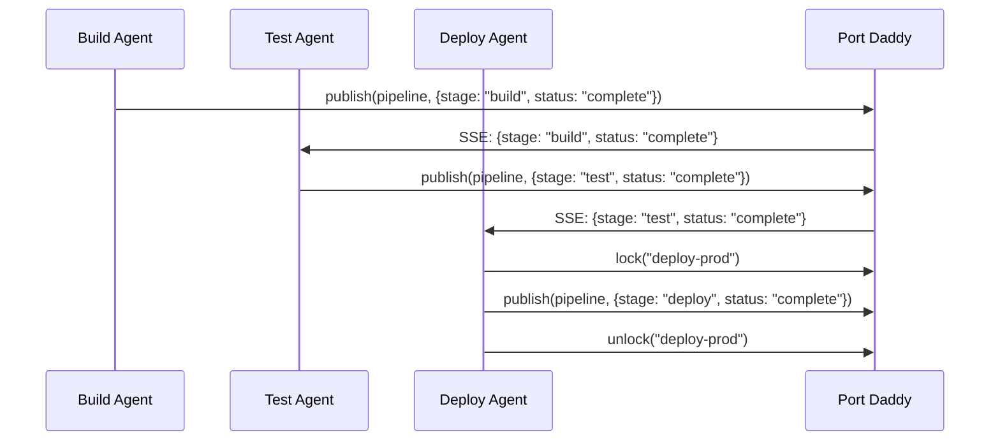

# Multi-Agent Coordination Patterns with Port Daddy

Real-world patterns for coordinating multiple Claude sessions or AI agents using Port Daddy's coordination primitives.

---

## Pattern 1: Leader Election

One agent coordinates work while others execute. Use a distributed lock as the election mechanism.

```js
import { PortDaddy } from 'port-daddy/client'

const pd = new PortDaddy({ agentId: 'agent-1' })

// Try to become leader
try {
  await pd.lock('leader-election', { owner: pd.agentId, ttl: 60000 })
  console.log('I am the leader')
  // Coordinate other agents via messaging
  await pd.publish('tasks', { action: 'build', target: 'frontend' })
} catch (err) {
  if (err.status === 409) {
    console.log('Another agent is leader, waiting for tasks...')
    const { message } = await pd.poll('tasks')
    // Execute assigned task
  }
}
```

---

## Pattern 2: Work Distribution (Fan-Out)

A coordinator splits work across multiple agents using pub/sub channels.

```bash
# Coordinator publishes tasks
curl -X POST localhost:9876/msg/tasks \
  -H 'Content-Type: application/json' \
  -d '{"payload":{"type":"test","suite":"unit","files":["a.test.js","b.test.js"]}}'

curl -X POST localhost:9876/msg/tasks \
  -H 'Content-Type: application/json' \
  -d '{"payload":{"type":"test","suite":"integration","files":["api.test.js"]}}'

# Workers poll for tasks
curl "localhost:9876/msg/tasks/poll?timeout=30000"
```

---

## Pattern 3: Pipeline Orchestration

Sequential stages where each agent hands off to the next via pub/sub.



---

## Pattern 4: Shared Resource Protection

Multiple agents need access to a shared resource (database migration, config file, etc.). Use locks.

```js
// Agent 1: Run database migration
await pd.withLock('db-migration', async () => {
  await runMigration()
}, { ttl: 120000 }) // 2 min TTL for safety

// Agent 2: Also needs to migrate — will wait or fail gracefully
try {
  await pd.lock('db-migration', { owner: 'agent-2' })
} catch (err) {
  if (err.status === 409) {
    console.log('Migration in progress, waiting...')
    // Poll until lock is released
  }
}
```

---

## Pattern 5: Service Discovery

Agents register their services so others can find endpoints.

```js
// API agent claims port and sets endpoint
const { port } = await pd.claim('myapp:api:main')
await pd.setEndpoint('myapp:api:main', 'local', `http://localhost:${port}`)

// Frontend agent discovers the API
const apiService = await pd.getService('myapp:api:main')
const apiUrl = apiService.endpoints?.local
// Use apiUrl to configure frontend proxy
```

---

## Pattern 6: Health-Aware Orchestration

Agents monitor each other through the registry and heartbeats.

```js
// Register with auto-heartbeat
await pd.register({ name: 'Worker-1', type: 'worker' })
const hb = pd.startHeartbeat(30000)

// Coordinator checks agent health
const { agents } = await pd.listAgents({ activeOnly: true })
const healthyWorkers = agents.filter(a =>
  a.type === 'worker' &&
  Date.now() - new Date(a.lastHeartbeat).getTime() < 60000
)
console.log(`${healthyWorkers.length} healthy workers available`)
```

---

## Pattern 7: Graceful Multi-Service Startup

Start services in dependency order using .portdaddyrc `needs` field.

```json
{
  "project": "myapp",
  "services": {
    "db": { "port": 5432, "cmd": "docker compose up postgres", "healthPath": "/health" },
    "api": { "port": 3100, "cmd": "npm run dev", "needs": ["db"] },
    "frontend": { "port": 3101, "cmd": "npm run dev -- --port ${PORT}", "needs": ["api"] }
  }
}
```

Run `port-daddy dev` — services start in topological order, each waiting for its dependencies' health checks to pass.

---

## Pattern 8: Event-Driven Webhooks

External systems react to Port Daddy events.

```bash
# Register webhook for service events
curl -X POST localhost:9876/webhooks \
  -H 'Content-Type: application/json' \
  -d '{
    "url": "http://localhost:8080/port-daddy-events",
    "events": ["service.claim", "service.release"],
    "secret": "my-hmac-secret"
  }'
```

Webhook payloads are HMAC-signed with the provided secret so receivers can verify authenticity.
